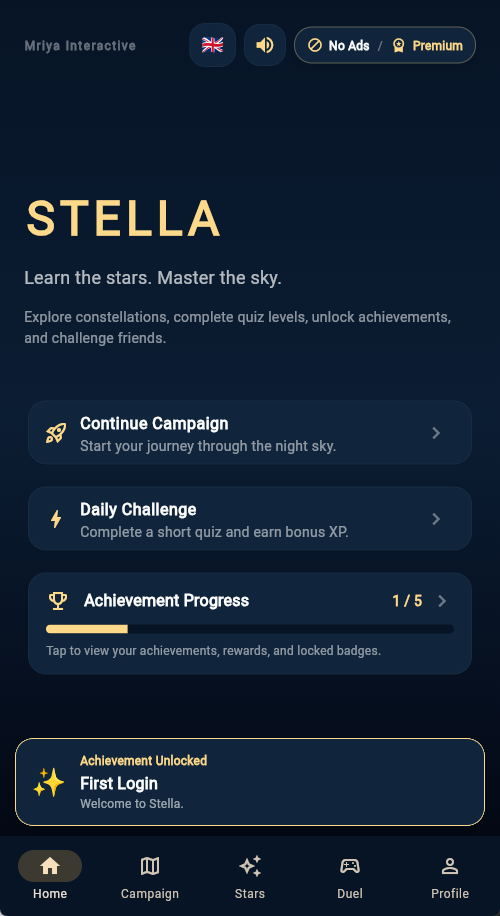
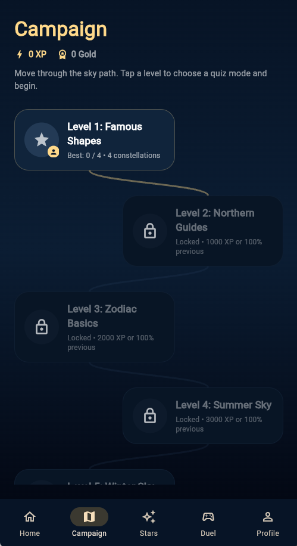
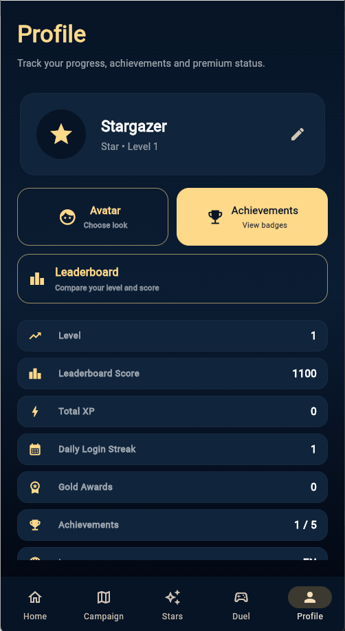
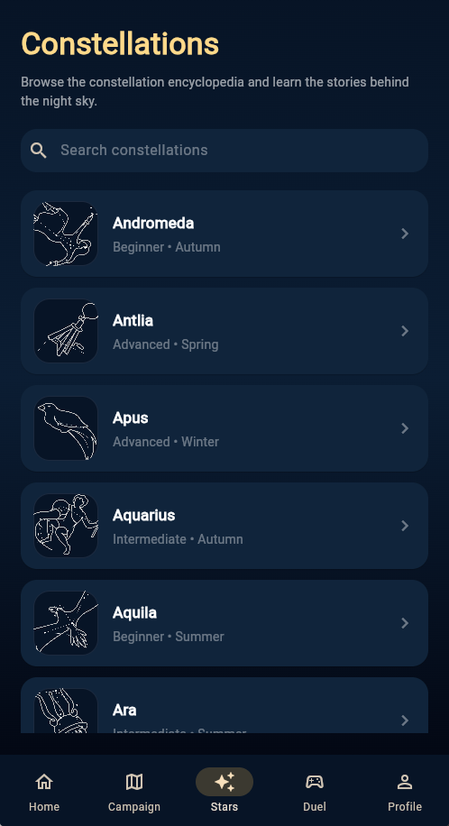
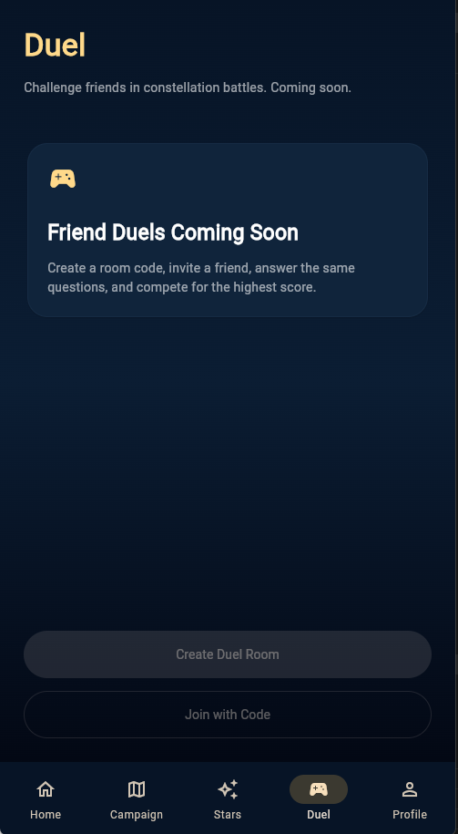
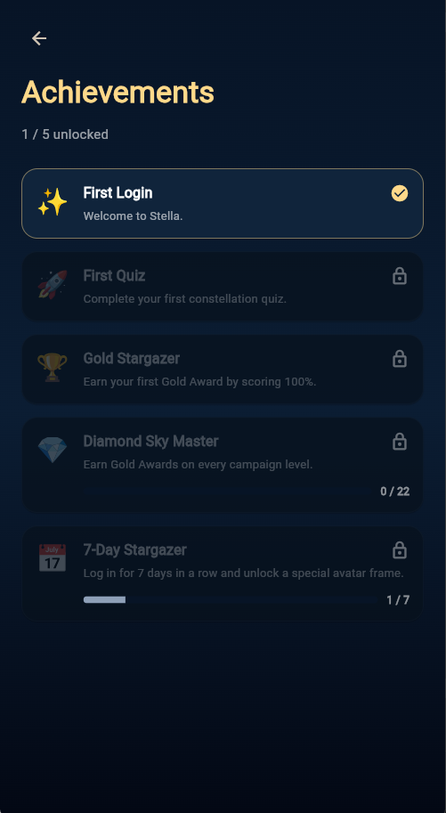

## Project Structure

```text
lib/
  data/
  models/
  quiz/
  screens/
  services/
  widgets/

assets/
  audio/
  avatars/
  app_icon/
  constellation_icons/
  constellations/

android/
```

---

## Screenshots

| Home                                 | Campaign                                     | Profile                                    |
| ------------------------------------ | -------------------------------------------- | ------------------------------------------ |
|  |  |  |

| Stars                                  | Duel                                 | Achievements                                         |
| -------------------------------------- | ------------------------------------ | ---------------------------------------------------- |
|  |  |  |

---

## Getting Started

### 1. Clone the repository

```bash
git clone https://github.com/hovova/stella-constellation-quiz.git
cd stella-constellation-quiz
```

### 2. Install dependencies

```bash
flutter pub get
```

### 3. Run the app

```bash
flutter run
```

For Android development, make sure an Android emulator or physical Android device is connected.

---

## Assets and Credits

Constellation images, app icon assets, and audio credits are listed in:

```text
ASSET_CREDITS.md
```

All assets should be checked for licensing before public release.

---

## Status

Stella is currently in active development. The main focus is building a polished Android v1 with campaign gameplay, achievements, multilingual support, and a clean Google Play-ready structure.

---

## License

This project is licensed under the terms listed in the `LICENSE` file.
